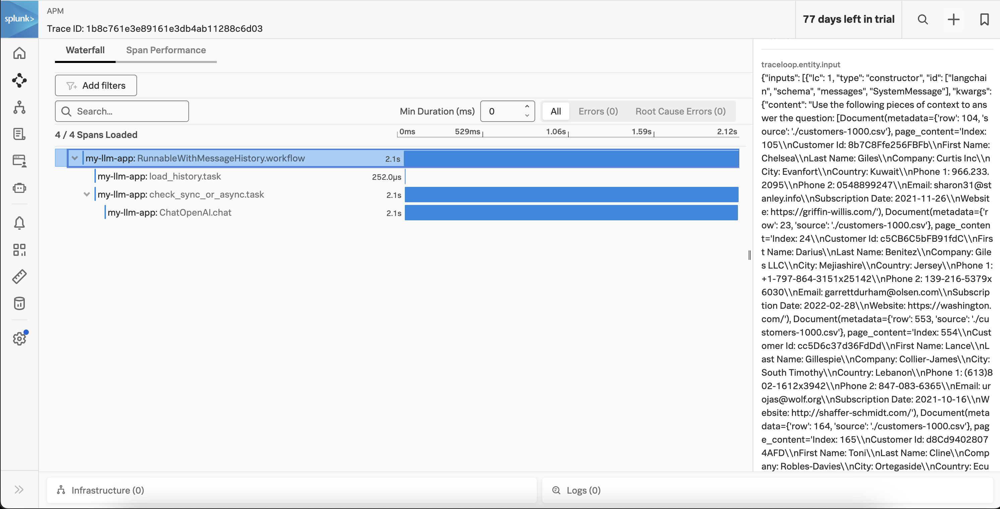

# v4:  Using Chroma DB with Embeddings

This version of the application adds a vector database (Chroma DB), and calculates embeddings 
for a sample set of customer data.  The embeddings are then used to determine which context 
to provide to the LLM to answer a question. 

## Prerequisites

* Python 3.9+
* [Splunk Distribution of the OpenTelemetry Collector](https://docs.splunk.com/observability/en/gdi/opentelemetry/opentelemetry.html#otel-intro-install) 
* An OpenAI account (set via the `OPENAI_API_KEY` environment variable) that has access to utilize the API

## Run the Application

Execute the following commands to run the application: 

````
# clone the repo if you haven't already
git clone https://github.com/dmitchsplunk/langchain-with-splunk.git

# navigate to the directory repo
cd langchain-with-splunk/v4

# create a virtual environment 
python3 -m venv openai-env

# activate the virtual environment
source openai-env/bin/activate

# install the required packages
pip3 install -r ./requirements.txt

# define the service name and environment
export OTEL_SERVICE_NAME=my-llm-app
export OTEL_RESOURCE_ATTRIBUTES='deployment.environment=test'

# load the customer data into Chroma DB 
# Note:  Running the customer_data.py program multiple times will result in 
# duplicate embeddings stored in the vector database. If needed, you can 
# delete the my_embeddings folder and run this program once to start fresh.
python3 customer_data.py

# now we can run the application that uses embeddings to answer questions 
splunk-py-trace flask run -p 8080
````

## Test the Application

We can use the existing question3.json and question4.json files with the following content: 

question3.json: 
````
{
  "question":"Which customers are associated with the company Cherry and Sons?"
}
````

question4.json: 
````
{
  "question":"And Giles LLC?"
}
````

Then open a second terminal window to exercise the application using the following curl command.

````
curl -d "@question3.json"  -H "Content-Type: application/json" -X POST http://localhost:8080/askquestion
````

It will respond with something like:

````
The customers associated with the company Cherry and Sons are:
1. Customer Id: 591CE8Bb3aB2D87
   - First Name: Christian
   - Last Name: Moore
   - City: South Anne
   - Country: Gambia
   - Email: moralesleslie@scott.com
   - Subscription Date: 2020-06-14
   - Website: https://stevens-crane.com/

2. Customer Id: 8aaa5d0CE9ee311
   - First Name: Marissa
   - Last Name: Gamble
   - City: Webertown
   - Country: Sudan
   - Email: katieallison@leonard.com
   - Subscription Date: 2021-11-17
   - Website: http://www.kaufman.org/
````

Since the application is retaining message history, it should be able to answer the following up 
question correctly as well: 

````
curl -d "@question4.json"  -H "Content-Type: application/json" -X POST http://localhost:8080/askquestion
````

It will respond with something like:

````
The customer associated with the company Giles LLC is:
1. Customer Id: c5CB6C5bFB91fdC
   - First Name: Darius
   - Last Name: Benitez
   - City: Mejiashire
   - Country: Jersey
   - Email: garrettdurham@olsen.com
   - Subscription Date: 2022-02-28
   - Website: https://washington.com
````

You should see a trace in Splunk Observability Cloud such as the following: 



## Deploying to k8s

Building a docker container
```shell
docker build -t my-llm-app .
```

Installing a helm chart to k8s
```shell
cd helm && helm install my-llm-app ./my-llm-app
```