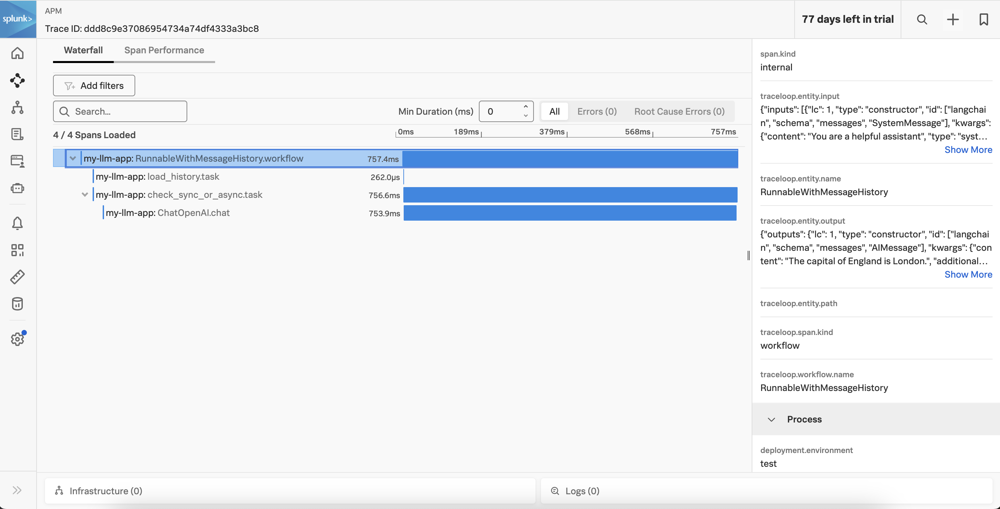

# v3:  Using message history

This version of the application adds message history, so our chat application retains context 
from earlier questions. 

## Prerequisites

* Python 3.9+
* [Splunk Distribution of the OpenTelemetry Collector](https://docs.splunk.com/observability/en/gdi/opentelemetry/opentelemetry.html#otel-intro-install) 
* An OpenAI account (set via the `OPENAI_API_KEY` environment variable) that has access to utilize the API

## Run the Application

Execute the following commands to run the application: 

````
# clone the repo if you haven't already
git clone https://github.com/dmitchsplunk/langchain-with-splunk.git

# navigate to the directory repo
cd langchain-with-splunk/v3

# create a virtual environment 
python3 -m venv openai-env

# activate the virtual environment
source openai-env/bin/activate

# install the required packages
pip3 install -r ./requirements.txt

# define the service name and environment
export OTEL_SERVICE_NAME=my-llm-app
export OTEL_RESOURCE_ATTRIBUTES='deployment.environment=test'

# run the application
splunk-py-trace flask run -p 8080
````

## Test the Application

We can use the existing question1.json and question2.json files with the following content: 

question1.json: 
````
{
  "question":"What is the capital of Canada?"
}
````

question2.json: 
````
{
  "question":"And England?"
}
````

Then open a second terminal window to exercise the application using the following curl command.

````
curl -d "@question1.json"  -H "Content-Type: application/json" -X POST http://localhost:8080/askquestion
````

It will respond with something like:

````
The capital of Canada is Ottawa.
````

Since the application is retaining message history, it should be able to answer the following up 
question correctly as well: 

````
curl -d "@question2.json"  -H "Content-Type: application/json" -X POST http://localhost:8080/askquestion
````

It will respond with something like:

````
The capital of England is London.
````

You should see a trace in Splunk Observability Cloud such as the following: 

