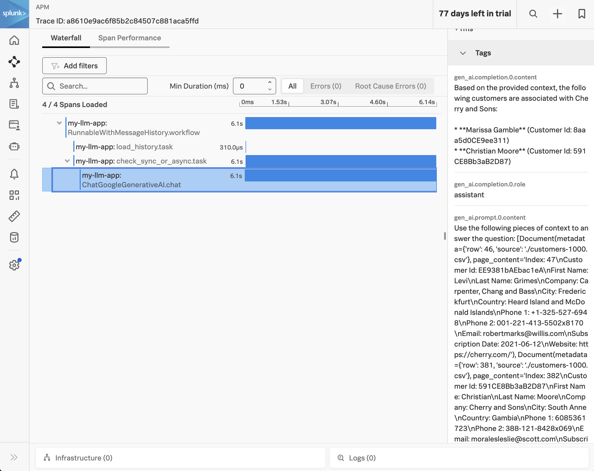

# v5:  Switching to Google Gemini

This version switches to a different LLM provider, Google Gemini, to demonstrate that it's easy 
to switch providers when using LangChain, and that we get similar results. 

## Prerequisites

* Python 3.9+
* [Splunk Distribution of the OpenTelemetry Collector](https://docs.splunk.com/observability/en/gdi/opentelemetry/opentelemetry.html#otel-intro-install) 
* A Google Cloud account (set via the `GOOGLE_API_KEY` environment variable) that has access to utilize Gemini
* Chroma DB has been populated by running the steps listed in [v4](../v4)

## Run the Application

Execute the following commands to run the application: 

````
# clone the repo if you haven't already
git clone https://github.com/dmitchsplunk/langchain-with-splunk.git

# navigate to the directory repo
cd langchain-with-splunk/v5

# create a virtual environment 
python3 -m venv openai-env

# activate the virtual environment
source openai-env/bin/activate

# install the required packages
pip3 install -r ./requirements.txt

# define the service name and environment
export OTEL_SERVICE_NAME=my-llm-app
export OTEL_RESOURCE_ATTRIBUTES='deployment.environment=test'

# now we can run the application that uses embeddings to answer questions 
splunk-py-trace flask run -p 8080
````

## Test the Application

We can use the existing question3.json file with the following content: 

question3.json: 
````
{
  "question":"Which customers are associated with the company Cherry and Sons?"
}
````

Then open a second terminal window to exercise the application using the following curl command.

````
curl -d "@question3.json"  -H "Content-Type: application/json" -X POST http://localhost:8080/askquestion
````

It will respond with something like:

````
Based on the provided context, the following customers are associated with Cherry and Sons:

* **Marissa Gamble** (Customer Id: 8aaa5d0CE9ee311)
* **Christian Moore** (Customer Id: 591CE8Bb3aB2D87) 
````

Notice that the format of the response is different from what we saw with the OpenAI example. 
However, the customer names are the same, so it's effectively the same answer. 

You should see a trace in Splunk Observability Cloud such as the following: 

